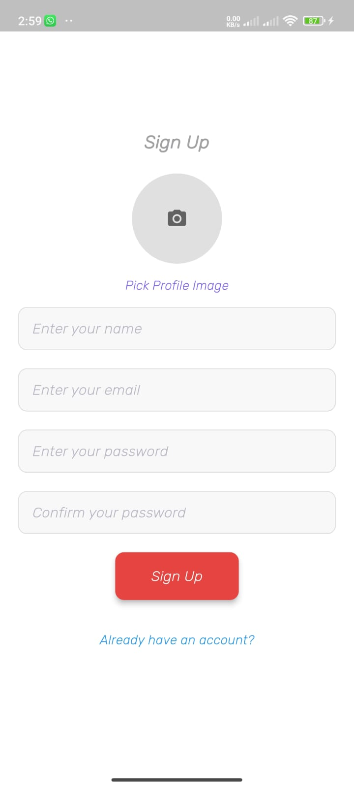
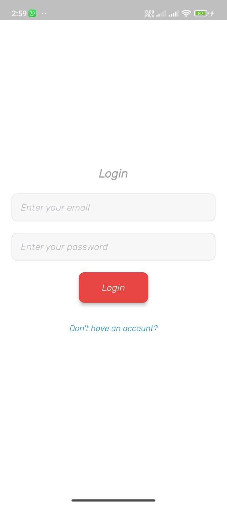
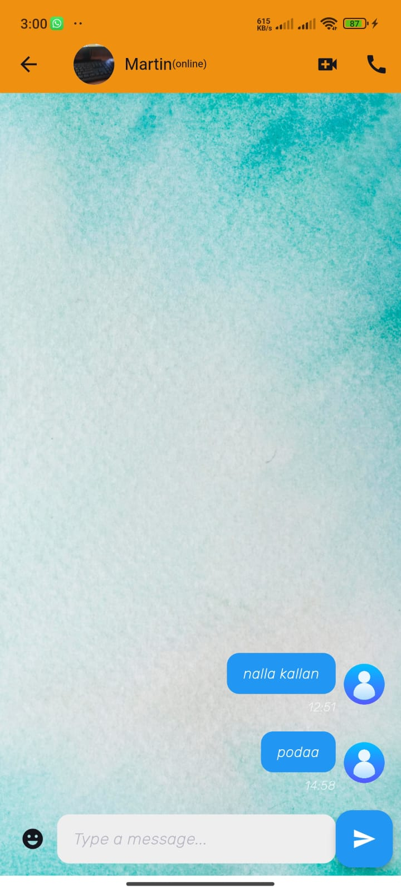

# ChatBuddy 📱💬

Welcome to **ChatBuddy**! This is a modern chat application built with Flutter and Firebase. It's designed to offer seamless real-time communication with a user-friendly interface.

## Features ✨

- **Real-Time Messaging**: Send and receive messages instantly.
- **Emoji Support**: Express yourself with a wide range of emojis.
- **Push Notifications**: Get notified when you receive new messages.
- **User Profiles**: Display user avatars and names in chat.
- **Local Notifications**: Stay updated with local notifications on your device.

## Getting Started 🚀

To get started with ChatBuddy, follow these steps:

1. **Clone the Repository**:
   ```bash
   git clone https://github.com/yourusername/chatbuddy.git
   cd chatbuddy


ChatBuddy 📱💬
ChatBuddy is a Flutter-based chat application designed to provide real-time messaging capabilities. This application leverages Firebase for backend services, including real-time database, authentication, and push notifications.

🚀 Getting Started
Follow these steps to set up and run ChatBuddy on your local machine:

1. Prerequisites
Before you start, ensure you have the following installed:

Flutter SDK
Dart SDK
Android Studio or Visual Studio Code with Flutter and Dart plugins
Firebase Project
2. Clone the Repository
Clone this repository to your local machine:

bash
Copy code

    git clone https://github.com/knightrome705/chatbuddy.git


        cd chatbuddy
        3. Install Dependencies
            Navigate to the project directory and install the necessary Flutter dependencies:

    bash
    Copy code
    flutter pub get
    4. Configure Firebase
        Go to the Firebase Console.
        Create a new project or use an existing one.
        Add an Android/iOS app to your Firebase project.
                Download the google-services.json file for Android or GoogleService-Info.plist for iOS.
                Place the google-services.json file in the android/app directory or the GoogleService-Info.plist file in the ios/Runner directory.
        5. Update Firebase Configuration
                Make sure to replace the firebase_options.dart file with your Firebase configuration. This file should be auto-generated if you followed Firebase setup instructions for Flutter.
        6. Run the Application
            You can run the application on an emulator or a connected device. Use the following command:
                bash
                Copy code
                flutter run
        7. Testing Push Notifications
                To test push notifications:

            Ensure your device or emulator is configured to receive push notifications.
            Send a test message from the chat screen to see if notifications are triggered.
            🛠️ Troubleshooting
            Ensure Firebase configuration files are correctly placed in their respective directories.
            Check the Firebase Console for any errors or warnings related to your project.
            Verify that your app has internet access.
            📧 Contact
            For any issues or feature requests, please open an issue on the GitHub repository.


            //images//


            <!!-----chatBuddy Splash Screen-----!>

            


            <!!-----chatBuddy Splash Signup Screen-----!>
            
            

            <!!-----chatBuddy Splash Login Screen-----!>


            


              <!!-----chatBuddy Splash Home Screen-----!>

              


              <!!-----chatBuddy Splash Chat Screen-----!>

              